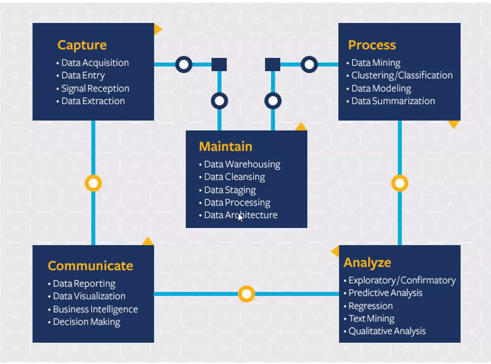
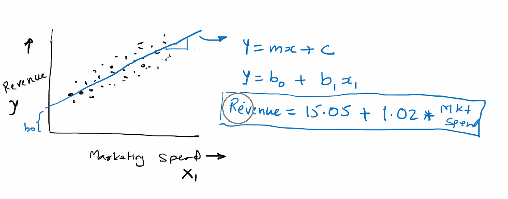

# Terminologies

---

1. **_Data Science_**
   1. It is an interdisciplinary academic field that uses statistics, scientific computing, scientific methods, processes , algorithms and systems to extract or extrapolate knowledge and insights from noisy, structured and unstructured data
      1. Unstructured data = data make sense, but we can't pin point exact location to get particular information.
   2. is a "Concept to unify statistics, data analysis, machine learning and their related methods" in order to "understand and analyze actual phenomena" with data.
   3. 
2. **_Why Data Science_** ?
   1. Businesses looking to use data to gain competitive advantage
   2. Technological advancements - data storage, processing power, clouse based storage and computing
   3. Burst in Data - Internet, electronic devices
   4. The ability to take data - to be able to understand it, to process it, to extract value from it, to visualize it, to communicate it - that's going to be ahugely important skill in the next decades. - Hal Varian.
3. **_What is Machine Learning ?_**
   1. Machine learning is a study of algorithms and statistical models that computer systems use in order to perform a specific taks effectively without being explicitly programmed, relying on patterns instead.
   2. 
   3. In libraries there are mathematical principles to generate equations for the given scenario
4. **_Artificial Intelligence vs Machine Learning vs Deep Learning_**
   1. Making machine intelliegent by any means
   2. Programs with the ability to learn and reason like humans
   3. There can be explicit programming (Rule based programs)
   4. Machine Learning
      1. Algorithms with the ability to learn without being explicitly programmed.
      2. Learn from pattern
   5. Deep Learning
      1. Subset of machine learning in which artificial neural networks adapt and learn from vast amounts of data
      2. Patterns drawn using neural network.
5. **_Uses of ML_**
   1. Data patterns are too complex and constantly changing. E.g. weather forecasting.
   2. We find it hard to express our knowledge about patterns as a program. e.g. Character recognition
   3. We do not readily have an algorithm to identify a particular pattern e.g. spam mail detection
6. **_Important Terms_**
   1. The value which we want to predict:
      1. Target variable, Dependant variable, Y, Predicted variable, Label
   2. The values using which we will attempt to predict:
      1. Features, Dimension, Independent Variables, Xs, Predictor variable
7. **_Classification_**
   1. Supervised Learning
      1. There is $Y$ to be predicted
      2. If $Y$ is a number i.e continuous variable then we call it as Regression
      3. If $Y$ is a category then it is called classification
   2. UnSupervised Learning
      1. There is no $Y$ to be predicted
      2. There is a logical group in data - cluster analysis - market segmentation
      3. Dimensionality Reduction
      4. Artificial Neural Network just needed linear algebra and metrics
8. **_Supervised Machine Learning_**
   1. 
9. **_Basic Statistics_**
   1. The collection of all data points is the **population** or the **universe** data for a process
   2. A subset of points drawn from a population is called **sample**
   3. Measurement of a characteristic of sample is called **Statistic**
   4. Measurement of a characteristic of population is called **Parameter**
   5. Types of Data
      1. Categorical - Preferred band
      2. Numeric
         1. Discrete - Number of items sold
         2. Continuous - Weight of a product
   6. Measurement Scale
      1. Categorical (Qualitative)
         1. Nominal - doesn't have order(gender)
         2. Ordinal - has meaningful order(appraisal rating)
      2. Numeric(Quantitative)
         1. Interval - Temperature in Celsius
            1. 
         2. Ratio - Cost of an item
   7. **Descriptive Stats**
      1. <mark style="background: #FF5582A6;">Central Tendency</mark>
         1. <mark style="background: #FFF3A3A6;">Mean</mark>: Arithmetic mean of numbers. Add the observations and divide by count of the observations. Mean is affected by extreme values.
            1. Gets Influenced by the outliers
            2. Eg: Salaries : 9,12,10,11,8, 130 Lakhs because of the 1.3cr package mean doesn't provide accurate representation
         2. <mark style="background: #FFF3A3A6;">Median</mark>: When observations are sorted in the ascending order, the middle observation is median. If we have n observations, the (n + 1)/2 th obervation is median. The median can be an observation or between two observations.
         3. Mode: Mode is the most frequently occuring data point in a data set.
      2. <mark style="background: #FF5582A6;">Range</mark>: It is the difference between the maximum and minimum values in a data set. Affected by extreme values
         1. Very sensitive to outliers than mean
      3. <mark style="background: #FF5582A6;">Inter Quartile Range (IQR) </mark>– IQR is the distance between the first and the third quartile.
         1. First quartile (Q1) has 25% observation lower than it.
         2. Third quartile (Q3) has 75% observation lower than it. $3 * (n + 1) / 4$
         3. Median is also called second quartile (Q2)
         4. Application of IQR will be finding outliers.
         5. Max length of whisker = 1.5 \* IQR
         6. 
         7. Any point which is less than Q1 - Max Length Whisker or Q3 + Max Length Whisker is a Outlier
         8. Can be used to tell where points are densly packed
      4. Variance and Standard deviation
         1. Variance is measured as the average of sum of squared difference between each data point(represented by xi) and the mean represented by
            1. N - consistent formula
            2. N - 1 - unbiased formula
         2. Standard deviation is one of the most popular measure of spread. It is the square root of the variance.
         3. 
      5. Normal Curve
         1. Outputs of a process vary due to various factors that come into play during the process
         2. Probability Distribution - Listing out all possible values along with their probabilities
            1. For continuous variables we can't list all values
               1. 
               2. This graph is said to be uniform Distribution
            2. 
         3. Area of the curve gives probability.
         4. Standard Normal Distribution is one where mean = 0 and standard deviation = 1
         5. 
         6. Sampling Distribution of Mean and Central Limit Theorem
         7. Z tells how many standard deviation away from mean.
      6. Hypothesis Testing
         1. A hypothesis is an educated guess or proposition that attempts to explain a set of facts or natural phenomenon.
         2. 
         3. 

# Algorithms

 ## Supervised Learning
	 ![[SupervisedLearning 2.png]]
	 1. Part of the data we givesome part for training and some part for testing. i.e 70 % to 80 % data will be going for training and 30 % to 20% rows will go for testing. The split is done randomly.
	 2.  ***K Nearest Neighbors***
		 1. Commonly used for classification
		 2. Can also be used for regression
		 3. Classification is determined based on a majority vote of the nearest neighbors of each point
		 4. Though it is a supervised learning method, it is a ‘lazy learner’, i.e. does not construct a model using training data.
		 5. Not suitable if the data is too noisy or the target classes do not have clear demarcation in terms of attribute values.
		 6. Suitable for classification where items in a class tend to be fairly homogenous on the values of attributes
		 7.  When classification is <mark style="background: #FF5582A6;">binary</mark> we can avoid tie by giving K an odd number.
			 1. 
		 8.  Distance Calculations
			 1. Euclidean distance $= \sqrt{ (x_{2} - x_{1}) ^{2} + (y_{2} - y_{2})^{2} }$
			 2. Manhattan / Taxi Distance $=  | x_{2} - x_{1}| + |y_{2} - y_{1} |$
			 3.  Minkowski = $(| x_{2} - x_{1}|^{p} + |y_{2} - y_{1} |^{p} + \dots) ^{1 / p}$
				 1. p = 1 manhattan
				 2. p = 2 Euclidean
			 4. Mahalanobis distance
			 5. Matching Distance(for Boolean Data) = $\frac{number\  of\ non\  equal\  dimensions}{number\  of\  dimensions}$
		 9.  We need to bring data to common scale(using min-max or Z)
			 1. ![[KNN_Example1.png]]
			 2.  Here if we see the distance 1 and 3 are less so they appear to be similar but with domain knowledge 1 and 2 will be same as they have same age.
			 3. In these cases distances could lead incorrect results to avoid that we use standardisation 
				 1.  Z- score $=\frac{x_{i} - \bar{x} }{S}$
				 2.  Min - max scaler = $\frac{X - min}{max -min}$ values between will  be between 0 to 1
				 3.  After applying min - max scaler ![[min-max-scaler.png]]
				 4. scaler.fit_transform(x_train)
					 1. ![[FitTransform.png]]
					 2. For test we should never do fit_transform. only transform to be used and the mean and std dev will be used from Xtrain because we want neighbours for test to be same as of train.
				 5.  ![[knn_snippet.png]] Classifier.fit doesn't create any model. It just map X_train and Y_train
		 10.  <mark style="background: #FF5582A6;">Training Accuracy</mark> :  Testing train data for accuracy `classifier.score(X_train, y_train)`
			 1. Why Training accuracy may not be 100 % because in K neighbours 1 neighbour will be itself. so if we try with k = 1 accuracy will be 100 % because each row maps to one in trained(train == test) 
		 11. Confusion Matrix:
			 1. ![[Pasted image 20230307145059.png]] `metrics.confusion_matrix(y_test, y_predict)` `print(metrics.classification_report(y_test, y_predict))`
			 2. Classification accuracy = correct predictions / total predictions
			 3.  Precision is the proportion of the predicted positive cases that were correct.
				 1. Precision of C = 15 / (15+1)
				 2. Precision of B = 19 / 19
				 3. Precision of  A = 15 / 15
			 4. Recall is the proportion of positive cases that were correctly identified 
				 1. Recall for B = 19 / (19+1)
				 2. Recall for A,C = 15 / 15
			 5. F1 score = $\frac{2*(Recall * Precision)}{(Recall + Precision)}$
	 3.  ***Linear Regression***
		 1. The term "linear" in the name “linear regression” refers to the fact that the method models data with linear combination of the explanatory (independent) variables.
		 2.  Covariance:
			 1. measures the join variability between two numerical variables (X and Y).
			 2. $Cov(x, y) = \frac{\sum{(x_{i} - \bar{x}) * (y_{i} - \bar{y})}}{n - 1}$
				 1. If Y increases with X then cov(x,y) > 0
				 2. If Y decreases with X then cov(x, y) > 0
			 3. Coefficient of correlation measures the strength of a linear relationship netween two variables (X and Y)
				 1. Value lies between -1 and 1
				 2.  $r = r_{{xy}} = \frac{Cov(x,y)}{S_{x} * S_{{y}}}$
				 3. ![[correlation.png]]

        